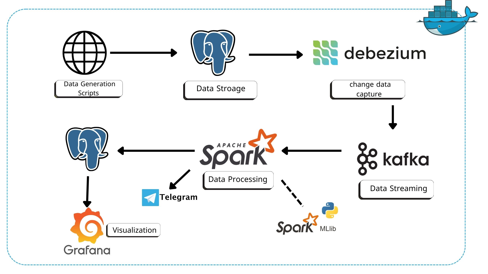
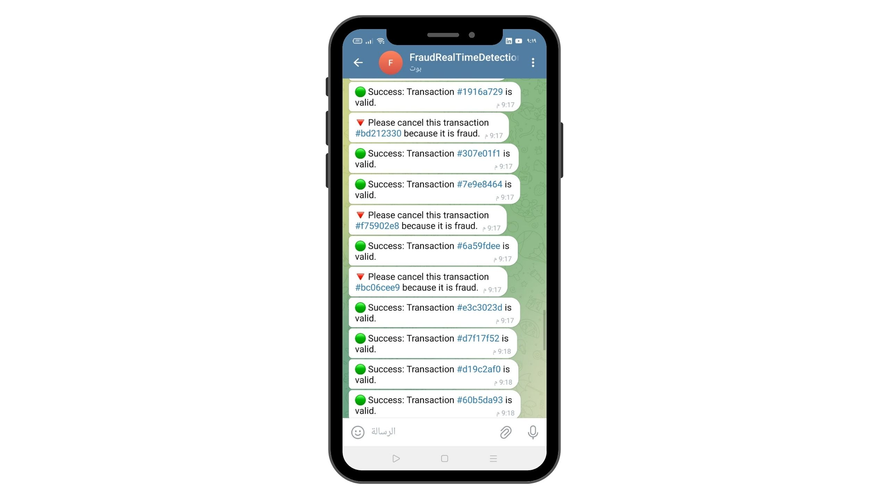
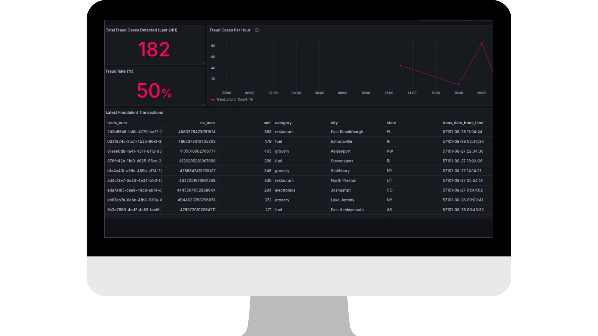

# Real-Time Fraud Detection System

This system uses **Machine Learning** to classify transactions, sends alerts through **Telegram**, and presents data via a **Grafana** Dashboard.

## Table of Contents
- [Tech Stack](#Tech-Stack)
- [Architecture](#Architecture)
- [Directories](#Important-Directories)
- [Setup Instructions](#Setup-Instructions)
- [Steps to Run](#Steps-to-Run)
- [Results](#Results)
- [Notes](#notes)
 

---

## Tech-Stack

- **Apache Kafka**: A distributed event streaming platform used for real-time data ingestion and message brokering.
- **Debezium**: A change data capture (CDC) tool that streams database changes to Kafka for real-time processing.
- **Apache Spark**: A powerful data processing engine that handles batch and streaming workloads, applying business logic and machine learning models.
- **PostgreSQL**: A relational database used for storing structured data.
- **Docker & Docker Compose**: Containerization tools for deploying.
- **Grafana**: Visualization and monitoring.
- **Telegram API**: Sends alerts for fraudulent transactions.

---


## Architecture

### Data Ingestion
1. transaction data is generated and stored in **PostgreSQL**.
2. **Debezium** captures database changes and streams them to **Kafka**.

### Stream Processing
1. **Kafka** acts as the message broker, streaming real-time transactions.
2. **Apache Spark** processes transactions, applying feature engineering and fraud detection model.
3. **Spark MLlib** utilizes a Random Forest model to detect fraudulent transactions.n


### Fraud Detection & Alerts
1. The **Random Forest** model analyzes transactions for fraudulent patterns.
2. Flagged transactions are stored in **PostgreSQL** for further investigation.
3. Real-time alerts are sent to **Telegram** for immediate action.


### Visualization
1. **Grafana** provides real-time monitoring and visualization of transaction data.



## Important-Directories

- **`Grafana/`**: Contains visualization queries.  
- **`Model/`**: Includes the training model and related data.  
- **`spark_apps/`**: Contains Spark code and the Telegram API integration.  
- **`spark_data/`**: Stores the Random Forest model.  
- **`docker-compose`**: Docker Compose file.  
- **`GenerateData`**: Script for generating data.  


## Setup-Instructions

- Ensure **Docker** and **Docker Compose** are installed.  
- Create a bot using **BotFather** on Telegram and obtain the **bot token** and **chat ID**.

## Steps-to-Run

1. **Clone the Repository**:
   ```bash
   git clone https://github.com/Salah-Mahmoud/real-time-fraud-detection.git
   cd real-time-fraud-detection
   ```
2. **Run Docker Compose**:
   ```bash
   docker compose up -d
   ```
3. **Run Data Generation Script**:
   ```bash
   python GenerateData.py
   ```
4. **Connect Debezium with PostgreSQL**:
   ```bash
    {
    "connector.class": "io.debezium.connector.postgresql.PostgresConnector",
    "topic.prefix": "cdc",
    "database.user": "admin",
    "database.dbname": "fraud_detection",
    "decimal.handling.mode": "string",
    "database.hostname": "postgres",
    "database.password": "admin",
    "name": "postgres-fraud-connectors",
    "plugin.name": "pgoutput"
    }
   ```

5. **Access the Spark Master Container**:
   ```bash
   docker exec -it spark-master bash
   ```
6. **Run the Spark Script**:
   ```bash
    spark-submit --master spark://spark-master:7077 \
    --packages org.apache.spark:spark-sql-kafka-0-10_2.12:3.5.3,\
    org.apache.kafka:kafka-clients:3.5.1,\
    org.postgresql:postgresql:42.7.1 \
    /opt/bitnami/spark/spark-apps/ScriptSpark.py
      ```
### 7. **Connect Grafana with PostgreSQL**  

- **Host:** `postgres:5432`  
- **Database:** `fraud_detection`  
- **User:** `admin`  
- **Password:** `admin`  
- **SSL Mode:** Disabled  


## Results

- **TelegramBot**



- **Grafana Dashboard**



## Notes  

- To connect **Debezium** with **PostgreSQL**, you need to switch the replication mode from **replica** to **logical**. This is handled using a **PostgreSQL init script**.  

- The dataset can be found here: [Fraud Detection Dataset](https://www.kaggle.com/datasets/kartik2112/fraud-detection).  

- The **Random Forest** model performed poorly due to imbalanced data. Also, I generated new data using a Python script instead of relying on the test dataset.


